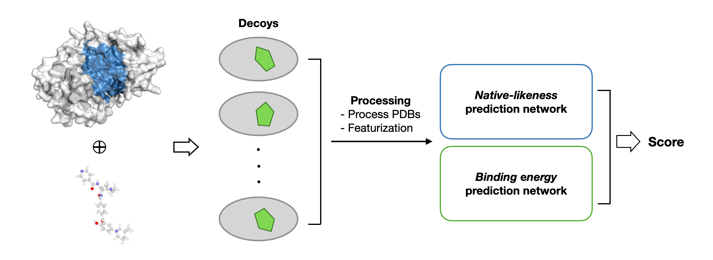

# DENOISer: Physics-inspired accuracy estimator for model-docked ligand complexes



## Setup Environment
```bash
conda env create -f environment.yaml
conda activate denoiser

# conda install pytorch=1.13.0 -c pytorch
# conda install pytorch-cuda=11.7 -c pytorch -c nvidia

pip install torch --index-url https://download.pytorch.org/whl/cu118

# Install dgl for your device (1 or 2)
# 1. CPU version
pip install  dgl -f https://data.dgl.ai/wheels/torch-2.3/repo.html
# 2. GPU version
pip install  dgl -f https://data.dgl.ai/wheels/torch-2.3/cu118/repo.html

pip install pydantic
pip install e3nn==0.5.1

# install denoiser
pip install -e .
```

## Usage

### Data preprocessing
./scripts/preprocess/README.md

### Inferece (Scoring)

```bash
# For model-docking
python ./scripts/inference.py -i <npz_features_path> --AF <af_plddt_path>
```
